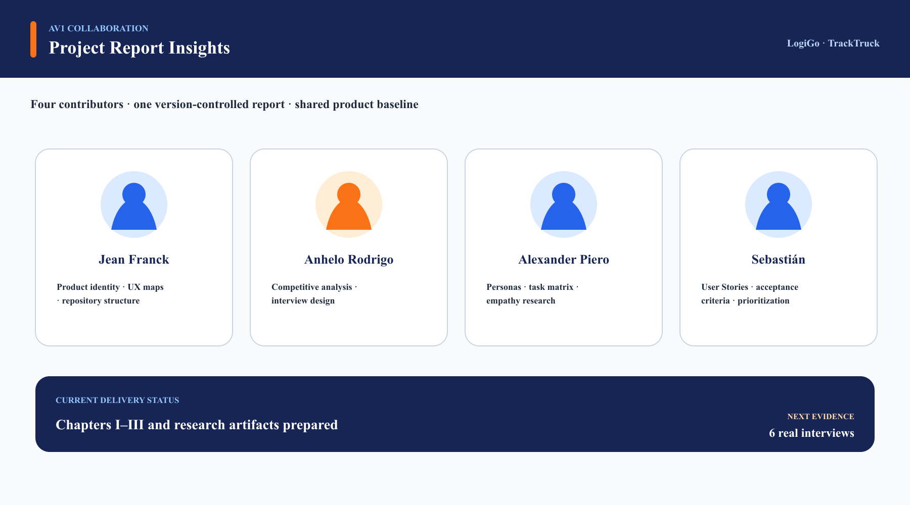

  

<h1 align="center">Universidad Peruana de Ciencias Aplicadas</h1>
<h2 align="center">Carrera de Ingeniería de Software</h2>

<h3 align="center">1ASI0657</h3>

<h3 align="center">Fundamentos de Arquitectura de Software </h3>
<h3 align="center">NRC</h3>
<h3 align="center">15987</h3>

<h1 align="center">Informe de Trabajo Final</h1>

<h3 align="center">Docente</h3>
<h2 align="center">Wilder Aurelio Vega Calero</h2>

<h3 align="center">Equipo</h3>
<h2 align="center">LogiGo</h2>

<h3 align="center">Proyecto</h3>
<h2 align="center">TrackTruck</h2>

<h2 align="center">Integrantes</h2>

<table align="center">
  <tr>
    <th>Código</th>
    <th>Apellidos y Nombres</th>
  </tr>
  <tr>
    <td>UXXXXXXXXXX</td>
    <td>Miembro 1</td>
  </tr>
  <tr>
    <td>U20221C803</td>
    <td>Rocca Leon, Anhelo Rodrigo</td>
  </tr>
  <tr>
    <td>U202019498</td>
    <td>Fernandez Garfias, Alexander Piero</td>
  </tr>
  <tr>
    <td>UXXXXXXXXXX</td>
    <td>Miembro 4</td>
  </tr>
  <tr>
    <td>UXXXXXXXXXX</td>
    <td>Miembro 5</td>
  </tr>
</table>

<h3 align="center">Periodo 202620</h3>

<h2 align="center">Registro de Versiones del Informe</h2>

| Versión | Fecha      | Autor | Descripción de modificación                                                                                                                                                                                                                                                              |
|---------|------------|-------|------------------------------------------------------------------------------------------------------------------------------------------------------------------------------------------------------------------------------------------------------------------------------------------|
| AV1     | 07-09-2026 | LogiGo | Creación del informe. Inclusión de Capítulos I, II, III y la inclusion del Sprint 1                                                                                                                                                                                              |

<h2 align="center">Project Report Collaboration Insights</h2>

**AV1.** Para la AV1, la elaboración del informe se centró en desarrollar los contenidos establecidos en la rúbrica, incluyendo la presentación de la startup y del producto, el proceso Lean UX, el análisis de competidores, las entrevistas, el Needfinding y la especificación de requisitos mediante User Stories, Impact Map y Product Backlog. Todos los integrantes participaron en la elaboración y revisión del informe, coordinándose mediante reuniones presenciales y reuniones virtuales por Discord, además del uso de GitHub para gestionar y consolidar los avances realizados.

## Contenido

- [Student Outcome](#student-outcome)
- [Capítulo I: Introducción](#capítulo-i-introducción)
    - [1.1. Startup Profile](#11-startup-profile)
        - [1.1.1. Descripción de la Startup](#111-descripción-de-la-startup)
        - [1.1.2. Perfiles de integrantes del equipo](#112-perfiles-de-integrantes-del-equipo)
    - [1.2. Solution Profile](#12-solution-profile)
        - [1.2.1. Nombre del producto](#121-nombre-del-producto)
        - [1.2.2. Antecedentes y problemática](#122-antecedentes-y-problemática)
        - [1.2.3. Lean UX Process](#123-lean-ux-process)
            - [1.2.3.1. Lean UX Problem Statement](#1231-lean-ux-problem-statement)
            - [1.2.3.2. Lean UX Assumptions](#1232-lean-ux-assumptions)
            - [1.2.3.3. Lean UX Hypothesis](#1233-lean-ux-hypothesis)
            - [1.2.3.4. Lean UX Canvas](#1234-lean-ux-canvas)
    - [1.3. Segmentos objetivo](#13-segmentos-objetivo)

- [Capítulo II: Requirements & Analysis](#capítulo-ii-requirements--analysis)
    - [2.1. Competidores](#21-competidores)
    - [2.2. Entrevistas](#22-entrevistas)
    - [2.3. Needfinding](#23-needfinding)
        - [2.3.1. User Personas](#231-user-personas)
        - [2.3.2. User Task Matrix](#232-user-task-matrix)
        - [2.3.3. Empathy Maps](#233-empathy-maps)
        - [2.3.4. As-is Scenario Mapping](#234-as-is-scenario-mapping)

- [Capítulo III: Requirements Specification](#capítulo-iii-requirements-specification)
    - [3.1. To-Be Scenario Mapping](#31-to-be-scenario-mapping)
    - [3.2. User Stories](#32-user-stories)
    - [3.3. Impact Map](#33-impact-map)
    - [3.4. Product Backlog](#34-product-backlog)

- [Conclusiones](#conclusiones)
    - [Conclusiones y recomendaciones](#conclusiones-y-recomendaciones)
    - [Video About-The-Team](#video-about-the-team)

- [Referencias Bibliográficas](#referencias-bibliográficas)

- [Anexos](#anexos)
    - [Links](#links)

### ABET – EAC - Student Outcome 7

**Aprendizaje Continuo y Autónomo**

**Criterio:** La capacidad de adquirir y aplicar nuevos conocimientos según sea necesario, utilizando estrategias de aprendizaje apropiadas.

En el siguiente cuadro se describen las acciones realizadas y los enunciados de conclusiones por parte del equipo, que permiten sustentar el haber alcanzado el logro del ABET – EAC - Student Outcome 7.

| **Avance** | **Integrante** | **Actualiza conceptos y conocimientos necesarios para su desarrollo profesional y en especial para su proyecto en soluciones de software.** | **Reconoce la necesidad del aprendizaje permanente para el desempeño profesional y el desarrollo de proyectos en soluciones de software.** |
|---|---|---|---|
| **AV1** | **Miembro 1** | Investigó y aplicó conceptos de Lean UX para contribuir en la definición de la problemática, los supuestos y las hipótesis de la solución propuesta. | Reconoció la importancia de actualizar continuamente sus conocimientos sobre metodologías UX para comprender mejor las necesidades de los usuarios y orientar el desarrollo del producto. |
|  | **Rocca Leon, Anhelo Rodrigo** | Aplicó técnicas de análisis de competidores y entrevistas para obtener información relevante sobre el mercado, los usuarios y sus principales necesidades. | Identificó la necesidad de fortalecer continuamente sus conocimientos en investigación y análisis de usuarios para sustentar decisiones durante el desarrollo de soluciones de software. |
|  | **Fernandez Garfias, Alexander Piero** | Profundizó en técnicas de Needfinding mediante la elaboración de User Personas, User Task Matrix y Empathy Maps para representar las características y necesidades de los usuarios. | Reconoció que el aprendizaje continuo de técnicas de UX y análisis de usuarios permite adaptar las soluciones de software a necesidades y contextos cambiantes. |
|  | **Miembro 4** | Aplicó nuevos conocimientos en la especificación de requisitos mediante la elaboración y organización de User Stories orientadas a las necesidades identificadas. | Reconoció la importancia de actualizar sus conocimientos sobre gestión y especificación de requisitos para mantener una adecuada relación entre las necesidades del usuario y las funcionalidades del producto. |
|  | **Miembro 5** | Fortaleció sus conocimientos sobre planificación de productos mediante la elaboración del Impact Map y la organización y priorización del Product Backlog. | Identificó la necesidad del aprendizaje permanente en técnicas de planificación y gestión de productos de software para responder adecuadamente a nuevos requerimientos y cambios del proyecto. |
|  | **Conclusiones** | **El equipo actualizó y aplicó conocimientos relacionados con Lean UX, investigación de usuarios, análisis de requisitos y planificación del producto, integrándolos en el desarrollo de los capítulos I, II y III del proyecto.** | **El equipo reconoció la importancia del aprendizaje continuo y autónomo para fortalecer sus competencias y adaptar el desarrollo de soluciones de software a las necesidades de los usuarios y a la evolución del proyecto.** |

# Capítulo I: Introducción

## 1.1. Startup Profile

### 1.1.1. Descripción de la Startup

LogiGo es una startup tecnológica orientada a mejorar la gestión y supervisión del transporte de carga mediante soluciones digitales. Identificamos que muchas empresas de transporte y logística presentan dificultades para monitorear en tiempo real la ubicación de sus vehículos, conocer el estado de sus rutas y mantener una comunicación directa con los conductores durante el recorrido. Esta falta de visibilidad puede generar demoras en la respuesta ante incidentes, menor control sobre las operaciones y dificultades para evaluar posteriormente lo ocurrido durante cada viaje.

Frente a esta problemática, LogiGo desarrolla **TrackTruck**, una plataforma orientada a la gestión y monitoreo del transporte de carga en tiempo real. La aplicación utiliza geolocalización para visualizar la ubicación de los camiones, supervisar los recorridos e identificar paradas, retrasos, tráfico, descansos, incidencias o posibles accidentes. Además, incorpora un sistema de comunicación mediante llamadas entre la empresa y los conductores, facilitando una respuesta rápida ante cualquier situación durante el trayecto.

Asimismo, TrackTruck mantiene un registro de las operaciones realizadas, incluyendo información sobre conductores, camiones, rutas, recorridos e incidencias. De esta manera, las empresas pueden consultar el historial de cada viaje, evaluar el desempeño de sus recursos y contar con una mayor trazabilidad de sus operaciones, mejorando el control, la seguridad y la capacidad de respuesta en el transporte de carga.

## 1.1.2. Perfiles de integrantes del equipo

| Foto | Información |
|---|---|
|  | **Nombre:** Miembro 1  **Código:** —  **Carrera:** Ingeniería de Software  **Acerca de mí:**  Soy estudiante de la carrera de Ingeniería de Software en la UPC. Me interesa fortalecer mis conocimientos y habilidades en el desarrollo de soluciones tecnológicas, participando activamente en las diferentes actividades y etapas del proyecto. |
|  | **Nombre:** Anhelo Rodrigo Rocca Leon  **Código:** U20221C803  **Carrera:** Ingeniería de Software  **Acerca de mí:**  Soy Anhelo Rodrigo Rocca Leon, estudiante de la carrera de Ingeniería de Software en la UPC. Tengo conocimientos en C++, HTML, CSS, JavaScript, C#, Python, Java y Flutter. Me interesa el desarrollo frontend para aplicaciones web y móviles, enfocándome en crear experiencias dinámicas, funcionales y adaptadas a las necesidades de los usuarios. |
|  | **Nombre:** Alexander Piero Fernandez Garfias  **Código:** U202019498  **Carrera:** Ingeniería de Software  **Acerca de mí:**  Soy Alexander Piero Fernandez Garfias, estudiante de la carrera de Ingeniería de Software en la UPC. Poseo conocimientos en C++, HTML, CSS, JavaScript, C#, Python, Java y Flutter. Me enfoco en el diseño y desarrollo frontend para aplicaciones web y móviles, aplicando creatividad y buenas prácticas para construir soluciones tecnológicas modernas y eficientes. |
|  | **Nombre:** Miembro 4  **Código:** —  **Carrera:** Ingeniería de Software  **Acerca de mí:**  Soy estudiante de la carrera de Ingeniería de Software en la UPC. Busco desarrollar mis competencias en análisis, diseño y construcción de soluciones de software, aplicando los conocimientos adquiridos durante mi formación académica. |
|  | **Nombre:** Miembro 5  **Código:** —  **Carrera:** Ingeniería de Software  **Acerca de mí:**  Soy estudiante de la carrera de Ingeniería de Software en la UPC. Tengo interés en seguir aprendiendo sobre tecnologías y metodologías relacionadas con el desarrollo de software, contribuyendo al trabajo colaborativo y al cumplimiento de los objetivos del proyecto. |

### 1.2.1. Antecedentes y problemática

**Who (¿Quién?) - ¿A quiénes afecta el problema?**  
Empresas de transporte de carga y operadores logísticos que necesitan supervisar sus vehículos, conductores y rutas durante el traslado de mercancías.

**What (¿Qué?) - ¿Cuál es el problema exactamente?**  
La falta de una plataforma centralizada que permita monitorear en tiempo real la ubicación de los vehículos, conocer el estado de los recorridos, mantener comunicación con los conductores y registrar las incidencias ocurridas durante cada viaje. Esto dificulta que las empresas tengan una visión completa y actualizada de sus operaciones de transporte.

**Where (¿Dónde?) - ¿En qué contexto ocurre?**  
En las operaciones de transporte terrestre de carga, principalmente durante el desplazamiento de camiones entre los puntos de origen y destino de las mercancías, con un enfoque inicial en empresas que operan dentro del mercado peruano.

**When (¿Cuándo?) - ¿En qué momento se manifiesta el problema?**  
Durante el desarrollo de los viajes y recorridos de transporte, especialmente cuando ocurren paradas no previstas, retrasos, congestión vehicular, problemas en la ruta, accidentes u otras incidencias que requieren una respuesta oportuna por parte de la empresa.

**Why (¿Por qué?) - ¿Por qué ocurre el problema?**  
El problema surge debido a la falta de integración entre el seguimiento de vehículos, la comunicación con los conductores y el registro de las operaciones. Cuando esta información se encuentra dispersa o no está disponible en tiempo real, las empresas tienen mayores dificultades para supervisar sus unidades y responder ante situaciones inesperadas.

**How (¿Cómo?) - ¿Cómo impacta en el usuario?**  
La falta de visibilidad y comunicación dificulta conocer el estado real de los vehículos y conductores, identificar retrasos o incidencias y tomar decisiones oportunas. Además, limita la posibilidad de consultar posteriormente lo ocurrido durante cada recorrido y evaluar el desempeño de los recursos involucrados.

**How Much (¿Cuánto?) - ¿Qué tan grande es el problema?**  
El transporte de carga requiere un seguimiento constante de vehículos, conductores y recorridos para garantizar el cumplimiento de las operaciones. La ausencia de herramientas que centralicen esta información puede generar menor capacidad de supervisión y respuesta ante incidencias. En este contexto, existe una oportunidad para soluciones como **TrackTruck**, que integren geolocalización, comunicación y registro histórico de las operaciones en una misma plataforma.

### 1.2.2. Lean UX Process

#### 1.2.2.1. Lean UX Problem Statements

**Problem statement:**  
Actualmente, muchas empresas dedicadas al transporte de carga enfrentan dificultades para supervisar de manera centralizada y en tiempo real sus vehículos, conductores y rutas. Aunque existen herramientas de geolocalización y comunicación, estas suelen encontrarse separadas, lo que dificulta obtener una visión completa del estado de cada operación y responder de manera rápida ante retrasos, incidencias o posibles accidentes.

Esta problemática afecta especialmente a empresas de transporte y operadores logísticos que necesitan conocer constantemente la ubicación de sus camiones, el avance de los recorridos y el estado de sus conductores. La falta de integración entre estas funciones puede generar menor control operativo, dificultades en la comunicación y poca trazabilidad de lo ocurrido durante cada viaje.

**TrackTruck** busca atender esta necesidad mediante una plataforma que centralice el monitoreo de vehículos, la geolocalización de rutas, la comunicación con los conductores y el registro histórico de las operaciones. La solución estará orientada inicialmente a empresas de transporte de carga del mercado peruano y priorizará la facilidad de uso, la visualización en tiempo real y el acceso rápido a información relevante para la toma de decisiones.

#### 1.2.2.2. Lean UX Assumptions

Lean UX Assumptions es una técnica que permite identificar las principales suposiciones relacionadas con el negocio, los usuarios y sus necesidades antes de desarrollar completamente una solución. Estas suposiciones permiten orientar las decisiones del equipo y posteriormente validarlas mediante investigación y retroalimentación de los usuarios, reduciendo el riesgo de desarrollar funcionalidades que no respondan a necesidades reales.

#### Business Outcomes

**Creemos que nuestros clientes necesitan:**  
Nuestros clientes necesitan una plataforma que les permita supervisar en tiempo real el transporte de su carga, conocer la ubicación de sus vehículos, visualizar el estado de las rutas, comunicarse directamente con los conductores y consultar el historial de las operaciones realizadas.

**Estas necesidades se pueden resolver con:**  
Estas necesidades se pueden resolver mediante **TrackTruck**, una plataforma que integre geolocalización en tiempo real, seguimiento de rutas y recorridos, comunicación mediante llamadas y un registro centralizado de conductores, vehículos, rutas e incidencias.

**Nuestros clientes iniciales son (o serán):**  
Nuestros clientes iniciales serán empresas de transporte de carga y operadores logísticos que administren vehículos y conductores y necesiten mejorar la supervisión y trazabilidad de sus operaciones.

**El valor #1 que un cliente quiere de nuestro servicio es:**  
El principal valor que nuestros clientes buscan es tener mayor visibilidad y control sobre sus operaciones de transporte, pudiendo conocer en tiempo real dónde se encuentran sus vehículos y cuál es el estado de cada recorrido.

**El cliente también puede obtener estos beneficios adicionales:**  
Además del monitoreo en tiempo real, los clientes podrán mejorar su capacidad de respuesta ante incidencias, mantener comunicación directa con los conductores, consultar el historial de los viajes y evaluar el desempeño de sus vehículos y conductores.

**Vamos a adquirir la mayoría de nuestros clientes a través de:**  
Buscaremos adquirir clientes principalmente mediante estrategias de marketing digital dirigidas a empresas de transporte y logística, presencia en redes profesionales, contacto directo con empresas del sector y alianzas estratégicas relacionadas con el transporte de carga.

**Haremos dinero a través de:**  
Generaremos ingresos mediante planes de suscripción dirigidos a empresas, considerando las funcionalidades ofrecidas y las necesidades de gestión de sus operaciones de transporte.

**Nuestra competencia principal en el mercado será:**  
Nuestra competencia estará conformada por plataformas de gestión de flotas, sistemas de rastreo GPS y otras soluciones digitales orientadas al seguimiento y administración del transporte de carga.

**Los venceremos debido a:**  
Buscaremos diferenciarnos mediante una solución que centralice en una misma plataforma el monitoreo de vehículos, seguimiento de recorridos, comunicación con conductores y consulta del historial de operaciones, priorizando además una experiencia de uso clara y accesible.

**Nuestro mayor riesgo de producto es:**  
Nuestro principal riesgo es que las empresas no perciban suficiente valor diferencial frente a otras soluciones de rastreo y gestión de flotas existentes, lo que podría dificultar la adopción de TrackTruck.

**Resolveremos esto a través de:**  
Buscaremos reducir este riesgo mediante la validación continua con usuarios, la incorporación de mejoras basadas en sus necesidades y la priorización de funcionalidades que aporten valor directo a la supervisión y gestión de las operaciones.

#### User Outcomes

**¿Quién será nuestro usuario?**  
Nuestros usuarios serán principalmente responsables de empresas de transporte de carga, gestores de flotas y operadores logísticos encargados de supervisar vehículos, conductores y recorridos.

**¿Dónde encaja nuestro producto en su vida?**  
TrackTruck formará parte de la gestión cotidiana de las operaciones de transporte, permitiendo a los usuarios supervisar desde una plataforma el estado de sus vehículos, conductores y rutas mientras se realizan los viajes.

**¿Qué problemas tiene nuestro usuario y cómo se pueden resolver?**  
Los usuarios pueden tener dificultades para conocer la ubicación actual de los vehículos, identificar retrasos o incidencias, comunicarse rápidamente con los conductores y consultar posteriormente lo ocurrido durante un recorrido. TrackTruck busca resolver estas necesidades centralizando el monitoreo, la comunicación y el historial de las operaciones.

**¿Cómo y cuándo es usado nuestro producto?**  
TrackTruck será utilizado principalmente durante las operaciones de transporte de carga. Los usuarios podrán consultar la ubicación y recorrido de los camiones, detectar paradas, descansos, retrasos, tráfico o posibles incidencias y comunicarse con los conductores cuando sea necesario. Después de cada viaje, también podrán consultar el historial de la operación.

**¿Qué problemas puede tener nuestro producto?**  
Algunos problemas potenciales incluyen una ubicación imprecisa debido a problemas de conectividad o GPS, dificultades de adopción por parte de algunos usuarios, dependencia de una conexión a Internet y la necesidad de mantener actualizada la información de vehículos, conductores y recorridos.

**¿Qué características son importantes?**  
Las características principales de TrackTruck incluyen geolocalización y seguimiento en tiempo real, visualización de rutas y recorridos, identificación de paradas, descansos, retrasos e incidencias, comunicación mediante llamadas y registro histórico de conductores, vehículos, rutas y operaciones.

#### 1.2.2.3. Lean UX Hypothesis Statements

**Hypothesis Statement 1:**  
Creemos que proporcionar a las empresas la **ubicación en tiempo real de sus vehículos y la visualización de sus recorridos** mejorará la visibilidad y el control sobre sus operaciones de transporte.  
Sabremos que esto es cierto cuando los usuarios puedan identificar con mayor facilidad la ubicación y el estado de los vehículos durante un viaje, reduciendo la necesidad de solicitar esta información directamente a los conductores.

**Hypothesis Statement 2:**  
Creemos que permitir la **identificación de paradas, descansos, retrasos, tráfico e incidencias durante el recorrido** facilitará la detección oportuna de situaciones que puedan afectar una operación de transporte.  
Sabremos que esto es cierto cuando los usuarios logren reconocer con mayor rapidez desviaciones o problemas durante los recorridos y puedan tomar decisiones a partir de la información proporcionada por TrackTruck.

**Hypothesis Statement 3:**  
Creemos que incorporar un **sistema de comunicación mediante llamadas entre la empresa y los conductores** mejorará la capacidad de respuesta ante problemas o situaciones inesperadas durante los viajes.  
Sabremos que esto es cierto cuando los usuarios puedan comunicarse directamente con los conductores desde la plataforma ante una incidencia, disminuyendo el tiempo necesario para establecer contacto y obtener información sobre lo ocurrido.

**Hypothesis Statement 4:**  
Creemos que mantener un **historial centralizado de conductores, vehículos, rutas, recorridos e incidencias** permitirá a las empresas contar con una mayor trazabilidad de sus operaciones de transporte.  
Sabremos que esto es cierto cuando los usuarios puedan consultar viajes anteriores y encontrar fácilmente información relevante sobre los recursos utilizados, los recorridos realizados y las incidencias registradas.

**Hypothesis Statement 5:**  
Creemos que centralizar el **monitoreo, la comunicación y el registro de las operaciones** en TrackTruck facilitará la gestión del transporte de carga y permitirá evaluar mejor el desempeño de los vehículos y conductores.  
Sabremos que esto es cierto cuando los usuarios utilicen la información recopilada por la plataforma para supervisar sus operaciones, revisar el desempeño de sus recursos y tomar decisiones con mayor información.

#### 1.2.2.4. Lean UX Canvas

### Segmento 1: Empresas de transporte de carga

Este segmento está conformado por empresas dedicadas al transporte terrestre de mercancías que administran una flota de vehículos y conductores. Estas organizaciones necesitan supervisar constantemente el desarrollo de sus operaciones para conocer la ubicación de sus unidades, verificar el cumplimiento de las rutas y responder oportunamente ante retrasos, paradas, accidentes u otras incidencias.

TrackTruck busca atender estas necesidades mediante una plataforma que centralice la geolocalización de los vehículos, el seguimiento de los recorridos, la comunicación con los conductores y el registro histórico de las operaciones. De esta manera, las empresas pueden obtener mayor visibilidad y trazabilidad sobre sus viajes y contar con información que facilite la supervisión de sus recursos.

**Segmento Objetivo: Empresas de transporte de carga**

| Característica | Descripción |
|---|---|
| Tipo de cliente | Empresa (B2B) |
| Sector | Transporte terrestre de carga |
| Ubicación | Perú |
| Usuarios principales | Gestores de flota, supervisores y responsables de operaciones |
| Recursos gestionados | Camiones, conductores, rutas y viajes |
| Necesidad principal | Supervisar y controlar las operaciones de transporte en tiempo real |
| Funcionalidades de mayor valor | Geolocalización, seguimiento de rutas, comunicación, incidencias e historial de operaciones |

### Segmento 2: Operadores y empresas de logística

Este segmento comprende operadores y empresas de logística que coordinan operaciones relacionadas con el traslado de mercancías y requieren mantener visibilidad sobre el desarrollo del transporte. Debido a que pueden gestionar múltiples rutas, vehículos y operaciones simultáneamente, necesitan acceder de manera rápida a información actualizada que facilite el seguimiento y la toma de decisiones.

Para este segmento, TrackTruck permite centralizar la información de los recorridos y consultar el estado de las operaciones en tiempo real. Asimismo, el registro de rutas, conductores, vehículos e incidencias permite mantener la trazabilidad de los viajes y consultar posteriormente lo ocurrido durante cada operación.

**Segmento Objetivo: Operadores y empresas de logística**

| Característica | Descripción |
|---|---|
| Tipo de cliente | Empresa (B2B) |
| Sector | Logística y gestión del transporte |
| Ubicación | Perú |
| Usuarios principales | Operadores logísticos, coordinadores y responsables de operaciones |
| Recursos supervisados | Vehículos, conductores, rutas y operaciones de transporte |
| Necesidad principal | Obtener visibilidad y trazabilidad sobre el transporte de mercancías |
| Funcionalidades de mayor valor | Monitoreo en tiempo real, seguimiento de recorridos, comunicación, historial e incidencias |

